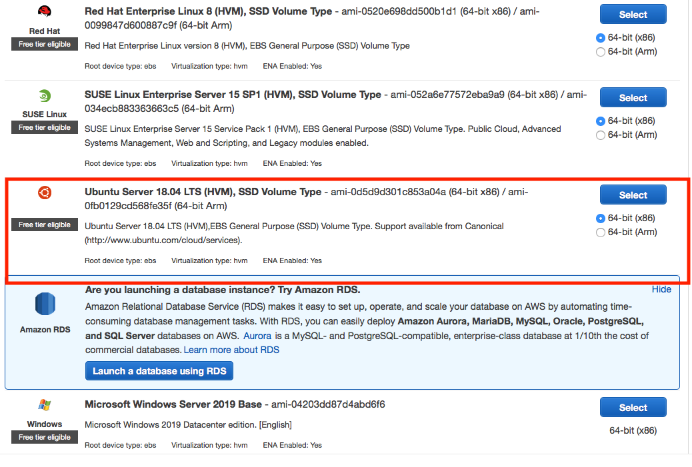
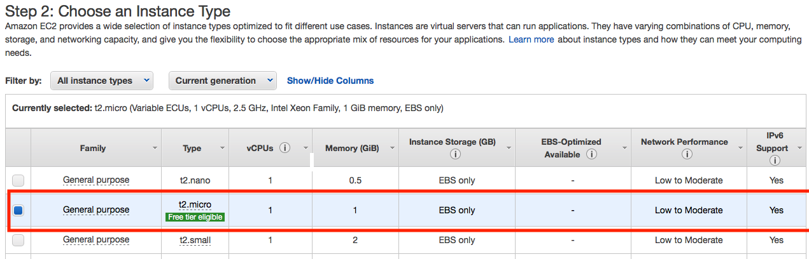
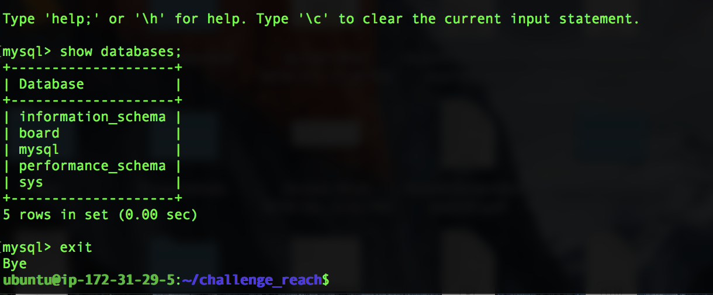
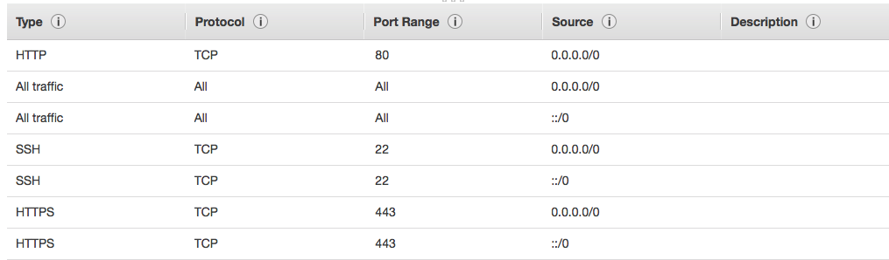

# 1. Hangman TOC

- [1.1. To do](#11-to-do)
- [1.2. Usage](#12-usage)
- [1.3. API endpoints](#121-api-endpoints)
- [1.4. Development Setup](#14-development-setup)
- [1.5. Log](#15-log)
  - [1.5.1. Setting up React without CRA](#151-setting-up-react-without-CRA)
    - [1.5.1.1 Configure Webpack](#1511-configure-webpack)
    - [1.5.1.2 Configure Babel](#1512-configure-babel)
    - [1.5.1.3 Make Webpack aware of Babel](#1513-make-webpack-aware-of-babel)
  - [1.5.2. Setting up API](#152-setting-up-api)
  - [1.5.3. Refactor Functionality around handleCheckLetter](#153-refactor-functionality-around-handleCheckLetter)
  - [1.5.4. Setting up MySQL](#154-setting-up-mysql)
  - [1.5.5. Deployment to AWS EC2 virtual machine](#155-deployment-to-aws-ec2-virtual-machine)

## 1.1. To do

```
 x setup React with Webpack and Babel
 x setup Express server
 x MAKE API SECTION IN README
 - revisit to bundle into a `dist` folder
  - Add error Handling
  x All-things-keyboard and UI'y
  x A mySQL based scoreboard component
  x And mysql in general
  x AWS EC2 deploy
	Stretch goals-
- A dictionary (clue) API- eg
- and corresponding compomemt
  Stretchy Stretch goals-
  -extract scoreboard module and have it deployed as it's own -standalone app to be rendered
	- Webscale and test Latency
   in the main app or a proxy
  A lil Over-the-top:
	-A blockchain powered scorring system of some sort

```

## 1.2. Usage

- At the start of the game the computer/secret-keeper will choose a dictionary word
- The guesser loses the game if they guess 6 letters that are not in the secret word
- The guesser wins the game if they guess all letters in the secret word correctly and have
- not already lost the game per the conditions above


## 1.3. API Endpoints

Below you can find all available endpoints.

+ GET `/difficulty`
  - when the user hits `easy`, `medium`, or `hard`, an `ajax` request on the client hits the server `/difficulty`.  The setting is then passed to the `getWordByDifficulty` method which pings the Linkedin API with an `axios` GET request.
  `${linkedinUrl}?difficulty=${rating}&count=50&minLength=4 `
   This returns 50 words according to that difficulty and we present the user with a random one from the collection as to avoid repeats

+ GET `/scoreboard`
  - in `componentDidMount`, this route is called which pulls the scoreboard from the database and renders the scoreboard component.

+ POST `/insertscore`
  - when the user wins, their score is entered into the database and the scoreboard is reconfigured to be immediately shown with the updated score if applicable (top 5).  Details in `1.5.4. Setting up MySQL`


## 1.4. Development Setup

- Server: [Express](http://expressjs.com/)
- Client: [React](http://reactjs.org/)
- Database: [mySQL](https://dev.mysql.com/doc/refman/5.7/en/)
- Deployment: [AWS EC2](https://aws.amazon.com/ec2/)
- Deployed Instance: [plz-hire-me Hangman](http://ec2-13-58-49-240.us-east-2.compute.amazonaws.com/)

```sh
# install npm dependencies
$> cd /path/to/hangman
$> npm install
# create .env file (for sql creds)
$> touch .env
# seed database `scoreboard` (change credentials as needed)
$> npm run seed-db
```

Inside `.env` place your SQL credentials (change if needed)

```
# DB_HOST=localhost
# DB_USER=root
# DB_PASS=
```

To execute:

```sh
$ npm run server-dev
$ npm run react-dev
```

## 1.5. Log

### 1.5.1. Setting up React without CRA

I work regularly with React but it had been a bit since I setup a React application from scratch.
I opted to forgoe using Create React App so I could get a review on what Webpack and Babel were doing behind the scenes.

#### 1.5.1.1 Configure Webpack

The command below installed:

- [webpack](https://webpack.js.org) as our module bundler and build tool.
- [webpack-dev-server](https://webpack.js.org/configuration/dev-server/) which serves our bundled app in `/public` in a local environment.
- [webpack-cli](https://webpack-gatsby.netlify.com/api/cli/) configures our Webpack with a config file

### 1.5.1. Setting up React without CRA

```sh
$> npm install --save-dev webpack webpack-dev-server webpack-cli
```

In the webpack configuration file, `./src/index.js` file as entry point to bundle all of source files and these bundled files will result in a `bundle.js` file which will be generated in `/public` folder.

```
webpack.config.js
```

```js
module.exports = {
  entry: './src/index.js',
  output: {
    path: __dirname + '/public',
    publicPath: '/',
    filename: 'bundle.js'
  },
  devServer: {
    contentBase: './public'
  }
};
```

#### 1.5.1.2 Configure Babel

This command:

```
$> npm install --save-dev babel-core babel-loader babel-preset-env babel-preset-stage-2 babel-preset-react
```

Installs:

- [babel](https://babeljs.io) Babel transpiles back our code to ES5 so it will work in all browsers.
- Also it converts JSX into Javascript:

So this:

```js
function NameComponent(props) {
  return <h1>{props.name}</h1>;
}
```

Becomes this:

```js
function NameComponent(props) {
  return React.createElement('h1', null, props.name);
}
```

#### 1.5.1.3 Make Webpack aware of Babel

Back in the `webpack.config` file, we add `module` and `resolve` keys.

```js
var path = require('path');

module.exports = {
  entry: './src/index.js',
  //Right Here:
  module: {
    rules: [
      {
        test: /\.(js|jsx)$/,
        exclude: /node_modules/,
        use: ['babel-loader']
      }
    ]
  },
  //And Here:
  resolve: {
    extensions: ['*', '.js', '.jsx']
  },
  output: {
    filename: 'bundle.js',
    path: path.join(__dirname, '/public')
  },
  devServer: {
    contentBase: './public'
  }
};
```
#### 1.5.2 Setting up API
- Will revisit commits to provide details

### 1.5.3. Refactor Functionality around `handleCheckLetter`
- Will revisit commits to provide details

### 1.5.4. Setting up MySQL
```sh
$> npm run seed-db
```
The above command runs the `schema.sql` file which seeds the database with existing players and top scores that will be rendered in the `Scoreboard` component

```sql
DROP DATABASE IF EXISTS board;

CREATE DATABASE board;

USE board;

CREATE TABLE players (
  player_id int NOT NULL AUTO_INCREMENT,
  player_name varchar(100),
  PRIMARY KEY (player_id)
) ENGINE=InnoDB;

CREATE TABLE scores (
  score_id int NOT NULL AUTO_INCREMENT,
  user_id int NOT NULL,
  score int NOT NULL,
  date varchar(20),
  FOREIGN KEY (user_id) REFERENCES players(player_id),
  PRIMARY KEY (score_id)
) ENGINE=InnoDB;

INSERT INTO players (player_name) VALUES ('Michelle');
INSERT INTO players (player_name) VALUES ('Ryan');
INSERT INTO players (player_name) VALUES ('Chris');
INSERT INTO players (player_name) VALUES ('OptimusPrime');

INSERT INTO scores (user_id, score, date) VALUES (2, 10, "10/01/2019");
INSERT INTO scores (user_id, score, date) VALUES (4, 25, "10/02/2019");
INSERT INTO scores (user_id, score, date) VALUES (1, 8, "10/03/2019");
INSERT INTO scores (user_id, score, date) VALUES (1, 5, "10/04/2019");
INSERT INTO scores (user_id, score, date) VALUES (3, 12, "10/05/2019");

```
Upon receiving a top score, and if the player is a new user, the `insertScore` database method first inserts the player's name into the the `players` table.  With a successful insert, an object with a property of `insertId` is returned from `mySQL` which is also the player's new `player_id`.  We then use this `player_id` to insert the new score into the `scores` table.  The database `getScoreBoard` method is then run to re-sort the scores and return our newscoreboard to be rendered as soon as the winning game is complete

### 1.5.5. Deployment to AWS EC2 virtual machine

Originally I wanted to deploy the database to a seperate virtual machine and have the app access it remotely.  But it had been a bit since I had to install mySQL from scratch.  I kept running into the dreaded `Access denied for user 'root'@'localhost'`. That took a considerable bit of more time than anticipated to get squared away.  So I just kept it all on one instance.  That being said, I used an Ubuntu server and cloned down my `08-deployed` branch.




Woop woop- connected to the virtual machine's database


The app was not rendering despite putting everything possible into the inbound security groups
I kept getting `Error: listen EACCES: permission denied 0.0.0.0:80`
After changing my server start script to include `sudo`, it was finally doing the thing

